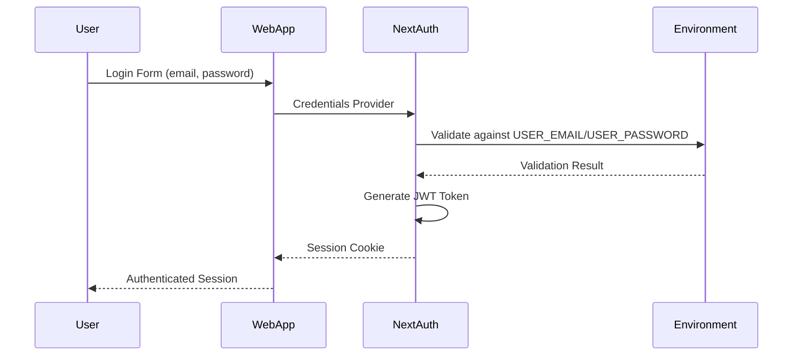
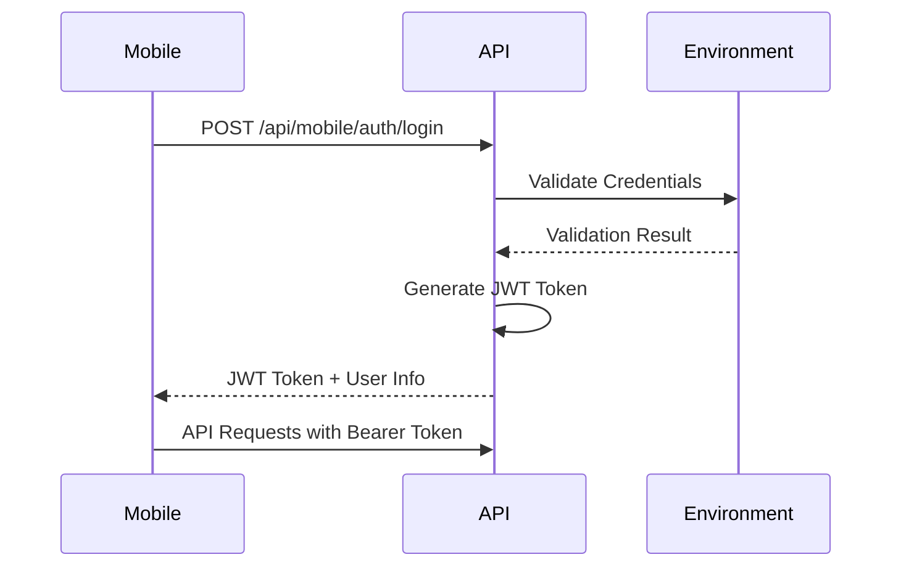

# Authentication Security

This document details the authentication security implementation in MegaVault Open Source.

## Authentication Architecture

MegaVault uses a **single-user authentication system** designed for personal cloud storage deployments.

### Core Components

1. **Environment-Based Credentials**
   - User credentials stored in environment variables
   - No database queries for authentication
   - Reduced attack surface compared to traditional user databases

2. **NextAuth.js Integration**
   - Industry-standard authentication framework
   - JWT-based session management
   - Secure cookie handling

3. **Stateless Authentication**
   - JWT tokens eliminate server-side session storage
   - Tokens include user context (email, folderId)
   - Configurable token expiration (30 days default)

## Authentication Flow

### Web Application Authentication



### Mobile Authentication



## Security Features

### 1. Credential Security

**Environment Variable Storage**
```bash
# Secure credential storage
USER_EMAIL=admin@yourdomain.com
USER_PASSWORD=secure-password-minimum-20-characters
NEXTAUTH_SECRET=cryptographically-secure-64-character-string
```

**Validation Requirements**
- Email format validation using regex
- Minimum password length recommendations (12+ characters)
- JWT secret minimum length (32+ characters)
- Detection of default/example values

### 2. JWT Token Security

**Token Configuration**
```typescript
// JWT Configuration
session: {
  strategy: 'jwt',
  maxAge: 30 * 24 * 60 * 60, // 30 days
}
```

**Token Contents**
- User email and folder ID
- Active status flag
- Standard JWT claims (iat, exp, etc.)
- Signed with NEXTAUTH_SECRET

### 3. Session Management

**Web Sessions**
- HTTP-only cookies for session storage
- Secure flag in production
- SameSite protection against CSRF

**Mobile Sessions**
- Bearer token authentication
- Token stored securely on device
- Manual token refresh required

## Security Validations

### Startup Validations

The system performs comprehensive security checks on startup:

```typescript
// Security validations in config.ts
- Required environment variables presence
- Email format validation
- JWT secret strength (32+ characters)
- Detection of default/example values
- Production HTTPS warnings
- Password strength recommendations
```

### Runtime Validations

```typescript
// Per-request validations
- JWT token signature verification
- Token expiration checks
- User active status verification
- Session hijacking prevention
```

## Attack Prevention

### 1. Brute Force Protection

**Recommended Implementations** (not currently built-in):
- Rate limiting on authentication endpoints
- Account lockout after failed attempts
- Progressive delays for repeated failures

**Mitigation Strategy**:
```bash
# Implement at reverse proxy level
# Example Nginx rate limiting
limit_req_zone $binary_remote_addr zone=auth:10m rate=5r/m;
location /api/auth {
    limit_req zone=auth burst=3 nodelay;
}
```

### 2. Session Hijacking Prevention

- JWT tokens signed with secure secret
- Token expiration enforced
- No session storage on server
- HTTPS required in production

### 3. Credential Stuffing Protection

- Single-user system reduces attack surface
- Environment-based credentials not in database
- No user enumeration possible
- Strong password requirements

## Production Security Checklist

### Pre-Deployment
- [ ] Change USER_EMAIL from default value
- [ ] Set strong USER_PASSWORD (20+ characters)
- [ ] Generate secure NEXTAUTH_SECRET (64+ characters)
- [ ] Verify no default values in environment
- [ ] Configure NEXTAUTH_URL with HTTPS

### Post-Deployment
- [ ] Verify HTTPS is working correctly
- [ ] Test authentication flow end-to-end
- [ ] Monitor authentication logs
- [ ] Set up failed login alerting
- [ ] Configure session timeout appropriately

## Monitoring and Logging

### Authentication Events to Log

**Successful Events**
```javascript
// Log successful authentications
{
  event: 'auth_success',
  email: user.email,
  timestamp: new Date().toISOString(),
  ip: req.ip,
  userAgent: req.headers['user-agent']
}
```

**Failed Events**
```javascript
// Log failed authentication attempts
{
  event: 'auth_failure',
  email: attempted_email,
  error: 'invalid_credentials',
  timestamp: new Date().toISOString(),
  ip: req.ip,
  userAgent: req.headers['user-agent']
}
```

### Monitoring Recommendations

1. **Set up alerts for**:
   - Multiple failed login attempts
   - Logins from new IP addresses
   - JWT token validation failures
   - Authentication system errors

2. **Regular reviews of**:
   - Authentication success/failure rates
   - Session duration patterns
   - Token expiration events
   - Error logs and patterns

## Common Security Issues

### Issue: Default Credentials
**Problem**: Using example values from `.env.example`
**Solution**: Automatic validation detects and prevents default values

### Issue: Weak JWT Secret
**Problem**: Short or predictable NEXTAUTH_SECRET
**Solution**: Minimum length validation and entropy recommendations

### Issue: HTTP in Production
**Problem**: Unencrypted authentication in production
**Solution**: HTTPS validation warnings and secure cookie configuration

### Issue: Long Session Duration
**Problem**: JWT tokens with excessive expiration times
**Solution**: Configurable session duration with reasonable defaults

## Security Updates

### Regular Maintenance
- Monitor NextAuth.js security advisories
- Update JWT libraries regularly
- Review authentication logs monthly
- Test authentication flow after updates

### Emergency Procedures
- JWT secret rotation procedure
- Session invalidation process
- Credential reset procedures
- Incident response for auth breaches

## Best Practices

### For Administrators
1. Use a dedicated email for MegaVault admin
2. Generate passwords using password managers
3. Enable 2FA where possible (future enhancement)
4. Regular credential rotation
5. Monitor authentication logs

### For Deployment
1. Use environment variable injection (not files)
2. Secure environment variable storage
3. Regular security assessments
4. Implement additional rate limiting
5. Set up proper monitoring and alerting

## Future Enhancements

### Planned Security Improvements
- [ ] Built-in rate limiting
- [ ] Two-factor authentication option
- [ ] Enhanced session management
- [ ] Advanced threat detection
- [ ] Audit trail improvements

### Community Contributions Welcome
- Rate limiting middleware
- Additional authentication providers
- Security monitoring tools
- Penetration testing results
- Security best practice documentation

---

**Critical Reminder**: The single-user design of MegaVault significantly reduces authentication attack surface, but proper configuration and monitoring remain essential for security.